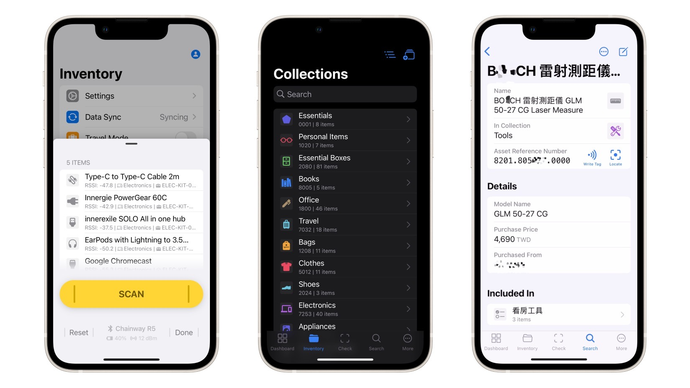

# Inventory

An RFID asset management solution for home or small businesses. https://youtu.be/CQt-VyFoBVI

## Download

This app is in early development and might have breaking changes. To try it out, contact @zetavg for the `.apk` file for Android or TestFlight installation for iOS.

## Build

The app is written with React Native (TypeScript), with native modules written in Java and Objective-C to handle UART/Bluetooth communications and full-text searching.

The source code is not ready for public release yet. If you are interested in the development, please contact @zetavg.
